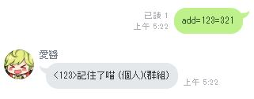
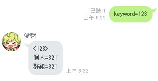
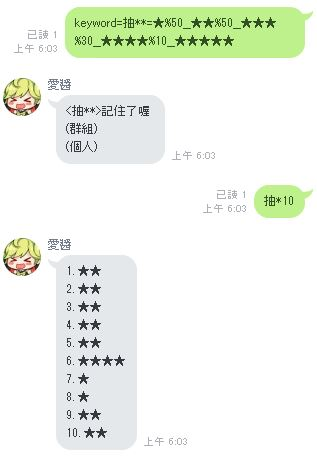

# LINE Chat Bot
只是一個LINE的聊天機器人  
附帶一些其他功能

本說明還在製作中  
還有許多地方沒有補齊  
姑且先將就著看吧  
圖片的部份盡量會在幾天內補齊  


```
                             ,,
                             ▌ "N     ╫ ╙╕
                       ╒"*=   *  └    ╘  ▐
                        N,
                                                    ╓▄MM▀▀▀▓N▄,
                                  ,,▄▄▄▄▄▄╓,,,  ,▄▀▐     ╓▀░æ░░▀N,
                      ▄@▀▀▓▓▓▓M▀░`       ░░░░░░█░░░jU  ,▓░a░░░░░░░▄
              ,,,,  ▄▀░░░▓╢▓░░░░░░░ ░░░░░░░░░░█░░░░░▌░╓▀░Ñ░░░░░░░░░▓
          ,▄▀└ ░░░░█░░░░▓▓▀░░░░░░░░░░░░░░░░░░▐░░░░░░▐▄▌╓░░░░░░░░░░░░▌
        ╓▀.▐  ░ ░░▐░░░░▓█░░░░░░░░░░░░░░░░░░░░▐░░░░░░░▀µ▓░░░░░░░░░░░░▐
       ▐▀  "▌░░░░░█░░░░█░░░░░░░░░░░░░░░░░░░░░░█░░░░░░░▀▌░░░░░░░░░░░░░▌
       █Mw,,▓░░░▄░▌░░░▓░░░░░░░░░░░░░░░░░░░░░░░╘█▓µ░░░░░▀▓▓▓▓▄▄▄▄▄▓▓▓▓▌,,,,
       ▌░░░░░▓░▓░░█░░▐▌░░░░░░░░░░░░░░░░░░░░░░░░░█▓▓▓▄,░░░▓╢▓▓▓▓▓▓▓▓▓█▓▓▓▓▓███▄,
       ▀▄░░░░▄█▌░░▐░░▓░░░░░░░░░░░░░░░░░░░░░░░░░░░░▀▓╢▓▓▓▓▓▓▓▓▓▓▓▓▓▓█████████████
        ▀▓▓▓▓▓█░░░░▓░▌░░░░░@░░░░░░░░░░░░░░░░░░░░░░░░░▀▀▓▓▓▓▓█▓▀▀▀░░▀█████████████
          ▀▓╢▓█░░░░░░▒░░░░░╙▌░░░░░░░░░░░░░░░░░░░░░░░░░░░░░░░░░░░░░░░▌▄▄▄"▀▓█▓▓▓▓▓█
             ▀█░░░░░░░░░░░░░░▓░░░░░░░░░░░░░░░░░░░░░░░░░░░░░░░░░,m▌░░▌   ▀▄"█▓▓▓▓▓▓▌
              ▐░░░░░░░░░░░░░░░▓▄░░░░░░░░░░░░░░░░░░░░░░░░░░░,▄M░░▓░░░▌    ╙▌╜▓▓▓▓▓▓▌
               ▓░░░░░░░░░░░░▄▀▒▒░N▄░░░░Ñw,░░░░░░░░░░░░▄▄@▀░░░░▄▀░░░▓      ▓ └▒╢╢╢▓▌
             ╓Ñ░░░░░░░░░░░▄▓░▒▒▒▒▒░▀N▄░░░ ░░╙▀▀▀▀▀▀▀▀░░░░░░▄▄▀░░░░╞▄,,    ▐U ▌▒▒▒▓
        ▄╦M╜░░░░░░░░░░░░▄▀░▒▒▒▒▒▒▒▒▒▒▒░▀ß@▄▄░░░░░░░░░,▄▄▄▓▓▓]▀N░░░░░▄▀  ` ▐L ▌░░▓`
        "▀Ñ▄▄▄▄▓╜░░░░▄Ñ▓▄░▒▒▒▒▒▒▒▒▒▒▒▒▒▒▒▒░▄▓▀▀▀▀▀▀▀░░▐▓▓▓▓░▓  █▓███▄ /   ▐ /╓U▀` ▐
            ,Æ░░░░▄█▀▒▒▒░░▀▀▓▄▄░▒▒▒▒▒▒▒▄▄▓▀░▒▒▒▒▒▒▒░▄▄╨▌▓▓░╓" ╓█▀██▓██   ▄▌▄▀`"  ,Å
            `""▀▐▓▓▓▒▒▒▄▄▄▄▓▀▀▀▀▒▒▒▒▒▒▒░░▀▀▀▀▀▀▀▀▀▀░` j▌░░╓▌▄M'   ▐▓▓▓▓*▀'') Æ"`
              ┌▄▓▓▓▓▌░░░▒░░╙""╙╙╙╙""```         ░ ▒░░ ▐░░▄▀       ▓▓█▀"N,    ,▓
                    ▓░░░░░░                    ░ ░░,▄██▄▓▒▓N    ╓▓  └    ▄▄#▓`
                      ▓@▄░░                  ,,▄@▀▀▀▓▓▒╢╢╢╢╢▓ ╓▀ ╜ ,ÆN╖,æ"  ▓▄▄,
                      ▓╣╢╫▓▓██▌*══∞∞∞∞∞∞Mⁿⁿ"`  ▀▓▄▓▓▓╢╣╢╢╢╣▓▓▀▀M╨`╙▄       ▄╣███╛
                       ▀▓▓╢█████▄,          ▄▄██████╣▓▒▓▓▀"         "▀▀╜╜╙▀▀"`
                           ``▀▀▀▀▀         ▀▀▀▀▀▀▀▀▀"`
```


# 一些建議的回復
因為回話功能我自己暫時砍了  
姑且暫時先寫在這裡


```
開車能給個例子嗎@@不知道BT跟磁力連結是甚麼
```
目前這功能重製中  
之後有介面會比較容易懂一點  
但我還是建議自己google一下補姿勢  
[BT介紹](http://mmdays.com/2007/04/06/bt1/)  
[磁力連結維基](https://zh.wikipedia.org/wiki/%E7%A3%81%E5%8A%9B%E9%93%BE%E6%8E%A5)  

```
隨機功能希望增加條件判斷回應，例如A>B或A%70/B%30 則回應C內容，否則回應D內容
```
看不太懂?

```
圖片引用網址希望可用一般HTTP網址還有支援UTF-8網址，如中文網址
```
https是line限制的  
是可以解決 但我沒很想優先做  
免費的圖床基本上都已經有https了  
剩下的圖床功能通常已足夠使用  
中文網址是支援的

```
如果愛醬能放歌會更好喔  
```
可以傳檔傳音樂傳影片  
但我想不到哪邊用的到這功能?  
能用情境說明嗎

```
冠綸好醜
```
誰

```
冠綸超級帥
```
是是是


# 索引
- [聊天功能](#基本格式)
    - [基本格式](#基本格式)
    - [新增關鍵字](#新增關鍵字)
    - [刪除關鍵字](#刪除關鍵字)
    - [查詢關鍵字](#查詢關鍵字)
    - [聊天設定](#聊天設定)
    - [回憶](#回憶)
- [開車功能](#開車功能)
- [其他功能](#其他功能)
- [問與答](#問與答)
- [待完成](#待完成)
- [更新紀錄](#更新紀錄)


## 聊天功能
---
### 基本格式
```
order=keyword=content##argv
命令=關鍵字=內容##其他參數
```
為了使用方便 命令有許多別名與簡寫  
關鍵字或內容可被省略 具體根據各功能用法而定  
其他參數目前還沒有全部套用

---
### 新增關鍵字
功能 | 格式 | 值 | 備註
--- | --- | --- | ---
命令詞可用字 ||  -a、add、keyword、新增、學習、關鍵字
新增一筆關鍵字 | 命令詞=關鍵字=內容
查詢關鍵字內容 | 命令詞=關鍵字
關鍵字萬用符 | 命令詞=關鍵字=\*\*內容\*\*內容\*\* | 雙米號 ** | 前後中間都可以加 不限數量
圖片內容 | 命令詞=關鍵字=圖片網址 | 圖片網址 | 必須使用https、格式jpg或png
內容分段 | 命令詞=關鍵字=內容A\|\|內容B | 雙直槓 \|\| | 優先權最低
內容分組隨機 | 命令詞=關鍵字=內容__內容 | 雙底線 __ | 優先權最高
隨機設定比重 | 命令詞=關鍵字=內容%比重__內容 | %比重 | 比重只能為整數、沒填預設為1
隨機設定保底 | 命令詞=關鍵字=*內容__**內容 | 單米號 *保底池、雙米號 ** 出貨
隨機設定種子 | 命令詞=關鍵字=內容__內容##種子=N | 雙井號 ## 後種子=N | 必須加在內容最後尾、單位一小時

---
#### 新增一筆關鍵字


---
#### 查詢關鍵字


---
#### 關鍵字萬用符


---
#### 圖片內容


---
#### 內容分段


---
#### 內容分組隨機


此例子 **吉、平、凶** 機率皆為 **1/3**

---
#### 隨機設定比重


此例子 **吉機率3/10** **平機率6/10** **凶機率1/10**

```
另外 為了可以做抽抽 如果關鍵字最後面有萬用字元 ** 的話
可以用*N來觸發多個 目前最大20 之後會上調
```



---
#### 隨機設定保底


從上面的例子修改了  
**★★★★ 前面多了 ** 表示加入保底池(A)與保底出貨池(B)  
*★★★★★ 前面多了 * 表示加入保底池(A)  
當10連發以上沒有出現保底池(A) (10為預設 調整見下面說明)  
那最後一發會從保底出貨池(B)中隨機選擇一個 (無法調整機率)  


調整保底數字 (預設10)  
如圖 ##保底=20 後必須要20連發才會保底  
所以10連發不一定出貨了

---
#### 隨機設定種子


1. 種子單位為小時  
2. 如果設定了種子 上面的多發(*N)會無效

---
### 刪除關鍵字
功能 | 格式 | 值 | 備註
--- | --- | --- | ---
命令詞 || -d、delete、del、刪除、移除、遺忘、忘記
刪除一筆關鍵字 | 命令詞=關鍵字


---
### 查詢關鍵字
功能 | 格式 | 值 | 備註
--- | --- | --- | ---
命令詞 || -l、list、列表
對象詞 || me、myself、我、自己
查詢註冊的關鍵字 | 命令詞 || 在群組使用默認群組、1:1使用只限對象自己
查詢自己註冊的關鍵字 | 命令詞=對象詞


---
### 聊天設定
說明待補

---
### 回憶
功能 | 格式 | 值 | 備註
--- | --- | --- | ---
命令詞 || -l、list、列表
對象詞 || me、myself、我、自己
隨機一條紀錄 | 命令詞
顯示完整記錄 | 命令詞=對象詞

---
## 開車功能
```
此功能暫時關閉
重製中
```

---
## 其他功能
* 上傳圖到圖床  


* google短連結

---
## 問與答


---
## 待完成
* 開車功能 (重製中)
* 網頁設定關鍵字
* 訂閱RSS
* 訂閱pixiv

---
## 更新紀錄
* 預計下次更新
  * 隨機功能保底可以每N就保底一次
  * 隨機功能整理 上限調至1萬
* 2017.11.04
  * +多發隨機可以使用圖片了(LINE限制最多5)
  * *修改隨機上限至100 (超過字數會被截斷) (下次新增整理版)
  * *修復圖床功能失效的問題 [使用方法](#其他功能)
  * [一些建議的回復](#一些建議的回復)
* 2017.11.01
  * +修改一些代碼 上傳github
  * +因為結構的優化 反應速度增加了一些
  * +新增隨機的保底功能
  * *調整觸發詞的優先度 現在是字多的優先(不含萬用字元)
  * *修復一些大小寫不辨識的問題
  * *開車功能暫時關閉
  * *修復空ID會觸發的問題
* 2017.10.20
  * +新增隨機的選項
* 2017.10.10
  * +查詢功能
  * *調整回憶功能
  * *調整公告的推送方式
  * *調整使用注意事項
  * -刪除群組關鍵字冷卻
* 2017.10.07
  * +飆車功能 (測試)
  * +回憶功能 (測試)
* 2017.09.30
  * +個人功能新增傳圖會上傳到圖床
* 2017.09.28
  * +新增群組可用別的群組關鍵字
  * +新增圖片網址檢查 防止出現包子
  * +個人功能新增傳網址會轉短網址
* 2017.09.27
  * +新增隨機模式
* 2017.09.24
  * +可以查詢個人關鍵字了
  * *優化回應訊息 比較容易讀懂了
  * *修復多段落沒辦法傳圖的bug
  * *修復一些小問題
* 2017.09.22
  + 新增了個人關鍵字 群組的關鍵字分離
  + 群組關鍵字如果有圖片會傳圖
